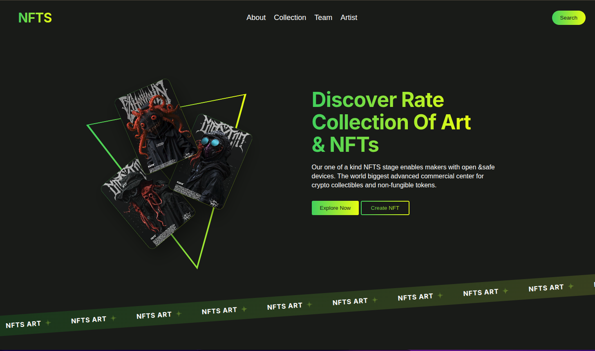

# Layout de Site

Este projeto é um layout de site simples em HTML, CSS e JavaScript.

## Site usado como base

## Estrutura

- index.html: estrutura principal da página
- style.css: estilos do layout
- script.js: interatividade da página
- img/: imagens utilizadas no projeto

## Como usar

1. Abra o arquivo index.html em um navegador.
2. Ou sirva a pasta com um servidor local, se preferir.
